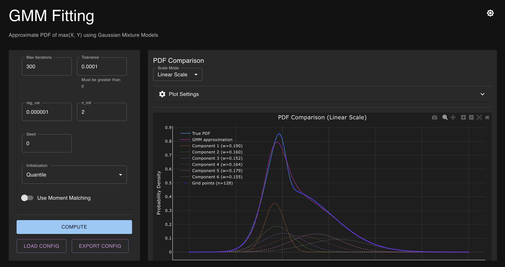

# gmm-pdf-fitting



ガウス混合モデル（GMM）による確率密度関数（PDF）の近似ライブラリ

このプロジェクトは、2変量正規分布の最大値の確率密度関数（PDF）を、ガウス混合モデル（GMM）で近似する実装です。3つのフィッティング方式を提供します：

1. **重み付きEMアルゴリズム** (`method: "em"`): 対数尤度最大化による従来のEM方式
2. **LPアルゴリズム** (`method: "lp"`): L∞誤差最小化による線形計画法方式
3. **Hybrid法** (`method: "hybrid"`): LP→EM→QPの統合手法

## 概要

- **2変量正規分布の最大値PDF**: `Z = max(X, Y)` の確率密度関数を計算
- **3つのフィッティング方式**: EM方式、LP方式、Hybrid方式から選択可能
- **EM方式の特徴**:
  - 重み付きEMアルゴリズム: PDFグリッドに1次元GMMをフィット
  - 5つの初期化方式: quantile, random, QMI, WQMI, MDNから選択可能
  - **MDN初期化**: 機械学習モデル（Mixture Density Network）による初期値推定で高速化・安定化
  - モーメント一致QP投影: オプションで1〜4次モーメント（平均、分散、歪度、尖度）を一致させるQP投影を適用
- **LP方式の特徴**:
  - PDF誤差のL∞最小化（`objective_mode="pdf"`）
  - 生モーメント誤差最小化モード（`objective_mode="raw_moments"`）：完全線形の生モーメント（M1-M4）マッチング
  - 辞書ベースの基底関数生成
- **Hybrid方式の特徴**:
  - LP法で大規模辞書から初期値を取得
  - EM法で微調整
  - オプションでQP射影によるモーメント一致
- **可視化**: 真のPDF、GMM近似、各コンポーネントをプロット表示
- **数値安定性**: `logsumexp`を使用した対数空間での計算（EM方式）
- **見やすい出力**: セクション構造化された標準出力で結果を表示

## 必要な環境

- Python 3.8以上
- uv（パッケージマネージャー）

## セットアップ

### 依存パッケージのインストール

**方法1: Makefileを使用（推奨）**

```bash
# 依存パッケージをインストール（仮想環境も自動的に作成されます）
make install
```

**方法2: 手動でインストール**

```bash
# 仮想環境を作成
uv venv

# 仮想環境を有効化
source .venv/bin/activate

# 依存パッケージをインストール
uv pip install -r requirements.txt
```

## 実行方法

### 方法1: JSON設定ファイルを使用（推奨）

```bash
# 仮想環境を有効化
source .venv/bin/activate

# デフォルトの設定ファイルを使用して実行
python main.py --config configs/config_default.json

# または、カスタム設定ファイルを指定
python main.py --config configs/config_lp.json
```

### 方法2: uv runを使用して実行

```bash
# デフォルトの設定ファイルを使用
uv run python main.py --config configs/config_default.json

# カスタム設定ファイルを指定
uv run python main.py --config configs/config_lp.json
```

### 方法3: 実行例スクリプトを使用

```bash
# PDF誤差最小化モードの例
python examples/example_pdf_mode.py

# モーメント誤差最小化モードの例
python examples/example_moments_mode.py
```

## プロジェクト構造

```
gmm-pdf-fitting/
├── src/
│   ├── gmm_fitting/          # GMMフィッティングパッケージ
│   │   ├── __init__.py
│   │   ├── em_method.py      # EM法の実装
│   │   ├── lp_method.py      # LP法の実装
│   │   └── gmm_utils.py      # GMMユーティリティ関数
│   └── ml_init/              # MDN初期化パッケージ
│       ├── __init__.py
│       ├── model.py           # MDNモデル
│       ├── train.py           # 学習スクリプト
│       ├── eval.py            # 評価スクリプト
│       ├── infer.py           # 推論API
│       ├── dataset.py         # データ生成
│       ├── metrics.py         # 評価指標
│       └── wkmeanspp.py       # 重み付きk-means++
├── configs/                  # 設定ファイル（JSON）
│   ├── config_default.json   # デフォルト設定
│   ├── config_lp.json        # LP法の設定
│   ├── config_hybrid.json    # Hybrid法の設定
│   └── ...
├── examples/                 # 実行例スクリプト
│   ├── example_pdf_mode.py
│   └── example_moments_mode.py
├── benchmarks/               # ベンチマークスクリプト
│   ├── benchmark.py
│   ├── benchmark_hybrid.py
│   └── results/
├── docs/                     # ドキュメント
│   ├── CONFIG_GUIDE.md
│   ├── HYBRID_METHOD_GUIDE.md
│   ├── TESTING.md
│   └── ...
├── tests/                    # テストファイル
├── webapp/                   # Webアプリケーション
│   ├── api.py                # FastAPI バックエンド
│   ├── models.py             # Pydantic モデル
│   └── frontend/             # React フロントエンド
├── main.py                   # メイン実行スクリプト
├── requirements.txt          # 依存パッケージ
├── Makefile                  # ビルドスクリプト
└── pytest.ini                # pytest設定
```

## 設定ファイル（JSON）

パラメータはJSONファイルで指定できます。設定ファイルの例は`configs/`ディレクトリにあります。デフォルトは`configs/config_default.json`です。

### EM方式の設定例

```json
{
  "mu_x": 0.0,
  "sigma_x": 0.8,
  "mu_y": 0.0,
  "sigma_y": 1.6,
  "rho": 0.9,
  "z_range": [-6.0, 8.0],
  "z_npoints": 2500,
  "K": 3,
  "method": "em",
  "max_iter": 400,
  "tol": 1e-10,
  "reg_var": 1e-6,
  "n_init": 8,
  "seed": 1,
  "init": "quantile",
  "use_moment_matching": false,
  "qp_mode": "hard",
  "soft_lambda": 1e4,
  "output_path": "pdf_comparison"
}
```

#### MDN初期化の設定例

```json
{
  "mu_x": 0.1,
  "sigma_x": 0.4,
  "mu_y": 0.15,
  "sigma_y": 0.9,
  "rho": 0.9,
  "z_range": [-4, 4],
  "z_npoints": 64,
  "K": 5,
  "method": "em",
  "max_iter": 30,
  "tol": 1e-4,
  "reg_var": 1e-6,
  "n_init": 1,
  "seed": 1,
  "init": "mdn",
  "mdn": {
    "model_path": "./ml_init/checkpoints/mdn_init_v1_N64_K5.pt",
    "device": "auto"
  },
  "use_moment_matching": false,
  "output_path": "pdf_comparison"
}
```

**MDN初期化の特徴**:
- `n_init=1`で十分（MDNが良い初期値を提供）
- `max_iter`を小さく（10〜30）しても高精度
- モデルパスの指定方法：
  - `mdn.model_path`で明示指定（最優先）
  - 環境変数`MDN_MODEL_PATH`
  - デフォルト: `./ml_init/checkpoints/mdn_init_v1_N64_K5.pt`

### LP方式の設定例

#### PDF誤差最小化モード（デフォルト）

```json
{
  "mu_x": 0.1,
  "sigma_x": 0.4,
  "mu_y": 0.15,
  "sigma_y": 0.9,
  "rho": 0.9,
  "z_range": [-4, 4],
  "z_npoints": 128,
  "K": 10,
  "L": 5,
  "method": "lp",
  "objective_mode": "pdf",
  "lp_params": {
    "solver": "highs",
    "sigma_min_scale": 0.1,
    "sigma_max_scale": 3.0
  },
  "output_path": "pdf_comparison_lp"
}
```

#### 生モーメント誤差最小化モード（推奨）

```json
{
  "mu_x": 0.1,
  "sigma_x": 0.4,
  "mu_y": 0.15,
  "sigma_y": 0.9,
  "rho": 0.9,
  "z_range": [-4, 4],
  "z_npoints": 128,
  "K": 10,
  "L": 10,
  "method": "lp",
  "objective_mode": "raw_moments",
  "lp_params": {
    "solver": "highs",
    "sigma_min_scale": 0.1,
    "sigma_max_scale": 3.0,
    "lambda_raw": [1.0, 1.0, 1.0, 1.0],
    "objective_form": "A",
    "pdf_tolerance": 0.01
  },
  "output_path": "pdf_comparison_lp"
}
```

### パラメータ説明

詳細なパラメータ説明は `docs/CONFIG_GUIDE.md` を参照してください。

#### 主要パラメータ

| パラメータ | 説明 | デフォルト |
|-----------|------|-----------|
| `mu_x`, `mu_y` | X, Yの平均値 | 0.0 |
| `sigma_x`, `sigma_y` | X, Yの標準偏差 | 0.8, 1.6 |
| `rho` | XとYの相関係数 (-1 〜 1) | 0.9 |
| `z_range` | PDFを計算する範囲 [z_min, z_max] | [-6.0, 8.0] |
| `z_npoints` | グリッド点数 | 2500 |
| `K` | GMMの成分数 | 3 |
| `method` | フィッティング方式 ("em", "lp", "hybrid") | "em" |

#### EM方式固有のパラメータ

| パラメータ | 説明 | デフォルト |
|-----------|------|-----------|
| `max_iter` | 最大反復回数 | 400 |
| `tol` | 収束判定の許容誤差 | 1e-10 |
| `reg_var` | 分散の正則化項 | 1e-6 |
| `n_init` | 初期化の試行回数 | 8 |
| `init` | 初期化方法 ("quantile", "random", "qmi", "wqmi", "mdn") | "quantile" |
| `use_moment_matching` | モーメント一致QP投影を使用するか | false |
| `qp_mode` | QP制約モード ("hard": 厳密一致、"soft": ペナルティ付き近似) | "hard" |
| `soft_lambda` | ソフト制約のペナルティ係数（大きいほどモーメント一致を重視） | 1e4 |

#### MDN初期化固有のパラメータ

| パラメータ | 説明 | デフォルト |
|-----------|------|-----------|
| `mdn.model_path` | MDNモデルのパス（最優先） | - |
| `mdn.device` | デバイス ("cpu", "cuda", "auto") | "auto" |

**モデルパスの解決順序**:
1. `mdn.model_path`（設定ファイル）
2. 環境変数`MDN_MODEL_PATH`
3. デフォルト: `./ml_init/checkpoints/mdn_init_v1_N64_K5.pt`

#### LP方式固有のパラメータ

| パラメータ | 説明 | デフォルト |
|-----------|------|-----------|
| `L` | シグマレベル数 | 5 |
| `objective_mode` | 目的関数モード ("pdf", "raw_moments") | "pdf" |
| `lp_params.solver` | LPソルバー | "highs" |

## MDN初期化の使い方

MDN（Mixture Density Network）初期化を使用すると、EMアルゴリズムの初期化を機械学習モデルで推定し、高速化・安定化が期待できます。

### 前提条件

- PyTorchがインストールされていること（`requirements-ml.txt`を参照）
- 学習済みMDNモデルが利用可能であること

### モデルの学習

```bash
# 1. 学習データの生成
python -m ml_init.generate_dataset \
  --output_dir ./ml_init/data \
  --n_train 80000 --n_val 10000 --n_test 10000 \
  --seed_train 0 --seed_val 1 --seed_test 2 \
  --z_min -8 --z_max 8 --n_points 64

# 2. モデルの学習
python -m ml_init.train \
  --data_dir ./ml_init/data \
  --output_dir ./ml_init/checkpoints \
  --batch_size 256 \
  --lr 1e-3 \
  --epochs 20 \
  --lambda_mom 0.0

# 3. モデルの評価（オプション）
python -m ml_init.eval \
  --model_path ./ml_init/checkpoints/mdn_init_v1_N64_K5.pt \
  --data_path ./ml_init/data/test.npz \
  --output_path ./ml_init/eval_results.json
```

### 使用方法

設定ファイルで`init: "mdn"`を指定するだけです：

```json
{
  "init": "mdn",
  "mdn": {
    "model_path": "./ml_init/checkpoints/mdn_init_v1_N64_K5.pt",
    "device": "auto"
  },
  "n_init": 1,
  "max_iter": 30
}
```

### フォールバック

MDN初期化が失敗した場合、自動的に以下の順序でフォールバックします：

1. **wkmeanspp**（重み付きk-means++）
2. **wqmi**（既存のWQMI初期化）
3. **quantile**（既存のquantile初期化）

## テスト

このプロジェクトにはPythonテスト（pytest）とフロントエンドテスト（Jest）が含まれています。

### テストの実行

```bash
# すべてのテストを実行（Python + フロントエンド）
make test

# Pythonテストのみ
make test-python

# フロントエンドテストのみ
make test-frontend

# カバレッジレポート付きで実行
make test-cov

# 詳細な出力で実行
make test-verbose
```

### テストファイル

- **Pythonテスト** (`tests/`):
  - `test_pdf_calculation.py`: PDF計算のテスト
  - `test_gmm_fitting.py`: GMMフィッティングのテスト
  - `test_lp_method.py`: LP方式のテスト
  - `test_hybrid_method.py`: Hybrid方式のテスト
  - `test_moments.py`: モーメント計算のテスト
  - `test_statistics.py`: 統計量計算のテスト
  - `test_webapp_api.py`: WebアプリAPIのテスト
  - その他

- **フロントエンドテスト** (`webapp/frontend/src/components/__tests__/`):
  - `ParameterForm.test.jsx`: パラメータフォームのテスト
  - `PlotViewer.test.jsx`: プロット表示のテスト
  - `ResultDisplay.test.jsx`: 結果表示のテスト
  - `StatisticsTable.test.jsx`: 統計テーブルのテスト

詳細は `docs/TESTING.md` を参照してください。

## Webアプリケーション（FastAPI + React）

GUIでパラメータを指定し、結果を可視化できるWebアプリケーションを提供しています。

### 主な機能

- **3つのフィッティング方式**: EM、LP、Hybrid方式を選択可能
- **インタラクティブなプロット**: Plotly.jsによる動的なプロット表示
  - 線形/対数スケールの切り替え
  - プロット範囲のカスタマイズ（X軸、Y軸）
  - 色、線のスタイル、線の太さの調整
  - グリッドポイントの表示/非表示
  - **GMMコンポーネントの個別表示**: 各正規分布成分をON/OFFで表示可能
- **統計比較テーブル**: 相対誤差に応じた色分け表示（誤差が小さい=緑、普通=黄、大きい=赤）
- **ダークモード**: ライト/ダークモードの切り替え（設定は自動保存）
- **設定のエクスポート/インポート**: 現在のパラメータをJSONファイルとして保存・読み込み可能

### セットアップ

**クイックスタート（Makefile使用）:**

```bash
# 1. 依存パッケージのインストール（初回のみ）
make webapp-install

# 2. Webアプリの起動
make webapp-start

# 3. ブラウザで http://localhost:3000 にアクセス

# 4. Webアプリの停止
make webapp-stop

# その他のコマンド
make webapp-status    # ステータス確認
make webapp-logs      # ログ表示
```

**手動起動:**

```bash
# 1. バックエンド依存パッケージのインストール
pip install -r webapp/requirements.txt

# 2. フロントエンド依存パッケージのインストール
cd webapp/frontend
npm install

# 3. バックエンドサーバーの起動（別ターミナル）
python -m webapp.api

# 4. フロントエンド開発サーバーの起動（別ターミナル）
cd webapp/frontend
npm run dev
```

詳細は `webapp/README.md` を参照してください。

## 性能評価（ベンチマーク）

包括的な性能評価を実施するには、`benchmark.py`スクリプトを使用します。

```bash
# EM法のベンチマーク
python benchmarks/benchmark.py --config configs/config_default.json --output benchmarks/results/benchmark_em.json

# LP法のベンチマーク（プロットも生成）
python benchmarks/benchmark.py --config configs/config_lp.json --output benchmarks/results/benchmark_lp.json --plot
```

### 評価項目

1. **実行時間**: 各手法の実行時間を測定
2. **PDF近似精度**: L∞誤差、L2誤差
3. **モーメント精度**: 平均、分散、歪度、尖度の誤差
4. **スケーラビリティ**: K（成分数）、グリッド解像度に対する性能

詳細は `docs/BENCHMARK_GUIDE.md` を参照してください。

## 依存パッケージ

### コアライブラリ（`requirements.txt`）

- `numpy>=2.0.0`: 数値計算ライブラリ
- `scipy>=1.0.0`: 科学計算ライブラリ
- `matplotlib>=3.5.0`: プロット作成ライブラリ

### Webアプリケーション

- **バックエンド** (`webapp/requirements.txt`): FastAPI, uvicorn, pydantic
- **フロントエンド** (`webapp/frontend/package.json`): React, Material-UI, Plotly.js

### MDN初期化（オプション）

- **ML依存** (`requirements-ml.txt`): PyTorch>=2.0.0
  - MDN初期化を使用する場合のみ必要
  - インストール: `uv pip install -r requirements-ml.txt`

## ドキュメント

- `docs/CONFIG_GUIDE.md`: 設定ファイルの詳細ガイド
- `docs/HYBRID_METHOD_GUIDE.md`: Hybrid法の詳細説明
- `docs/LP_RAW_MOMENTS_GUIDE.md`: LP生モーメントモードの説明
- `docs/TESTING.md`: テストの実行方法
- `docs/BENCHMARK_GUIDE.md`: ベンチマークの実行方法

## ライセンス

このプロジェクトのライセンス情報については、LICENSEファイルを参照してください。

## コントリビューション

プルリクエストやイシューの報告を歓迎します。
